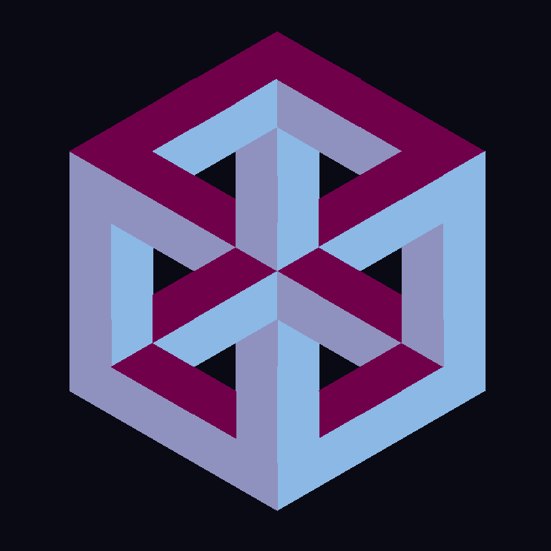

# Paradoxica
**Paradoxica** is a creative tool for constructing and exploring **impossible geometries** using a dynamic, hexagonally-tiled system.
---

 <!-- Replace this with the actual file path in your repo -->

---
